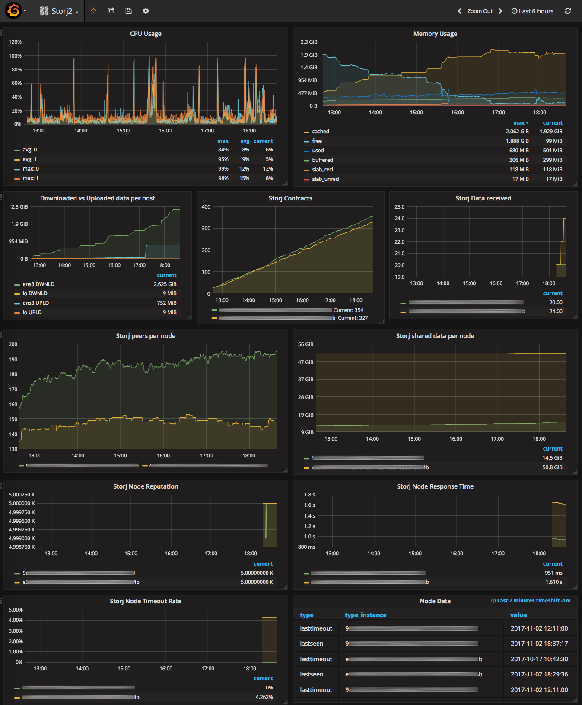

# Storj collectd plugin

This nodejs command is meant to be used with collectd exec plugin to monitor your [Storj.io](https://storj.io) nodes along with some 
Grafana/influxdb like solution. 



## Setup

Using yarn:

```
yarn global add storj-collectd-plugin
```

Using npm:

```
npm install -g storj-collectd-plugin
```

Then you need to add the following lines in your collectd config:

```
# /etc/collectd/collectd.conf

LoadPlugin exec

<Plugin exec>
        Interval 120
        Exec "youruser" "collectd-storj-exec-plugin"
</Plugin>
```

Finally, add the following lines in `/usr/share/collectd/types.db`:

```
peers                   value:GAUGE:0:U
shared                  value:GAUGE:0:U
restarts                value:GAUGE:0:U
contracts               value:GAUGE:0:U
delta                   value:GAUGE:0:U
percentused             value:GAUGE:0:100
```
